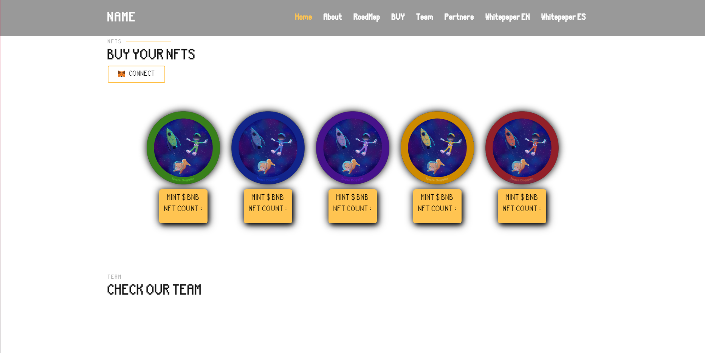

# NFT Game Presale Landing Page

Welcome to the NFT Game Presale Landing Page project! This project is designed to showcase information about an upcoming NFT game project and allow users to connect their wallets and participate in the presale by purchasing NFTs of different rarities.

## About the Project
This landing page serves as a hub for the upcoming NFT game project. It provides users with detailed information about the game, its mechanics, team members, and other relevant details. Additionally, users can connect their cryptocurrency wallets and purchase NFTs directly from the website.

## Features
- **Project Information**: Detailed information about the NFT game project, including its concept, gameplay mechanics, roadmap, and team members.
- **Connect Wallet Option**: Users can connect their cryptocurrency wallets (such as MetaMask) to the website to participate in the presale.
- **NFT Presale**: The landing page includes options for users to purchase NFTs of different rarities directly from the website. Each NFT type may have unique attributes or benefits.
- **Responsive Design**: The landing page is designed to be responsive and accessible across various devices and screen sizes.

## Technologies Used
- React/Next: Frontend development for the landing page layout and design.
- JavaScript: Implementing interactive features such as wallet connection and NFT purchase options.
- Web3.js: Integrating wallet connectivity and smart contract interactions for NFT purchases.

## Live Preview
You can view the live preview of the NFT Game Presale Landing Page [here]([https://example.com](https://tobias-jensen--portfolio.000webhostapp.com)https://tobias-jensen--portfolio.000webhostapp.com).

